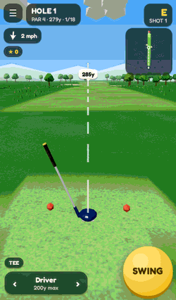
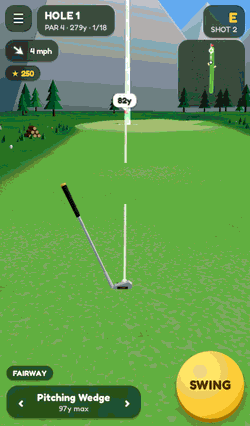
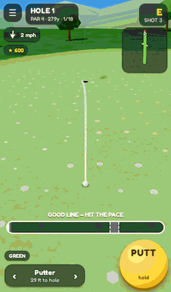
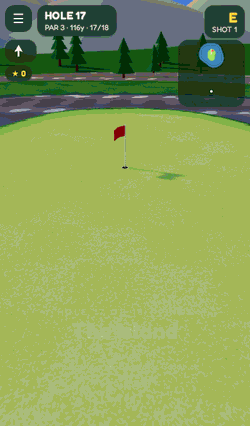

# ThreeWood

A procedurally generated 3D golf game for the browser — mobile first — built with Three.js.

Every round is a fresh 18-hole, par-72 course grown from a shareable seed — same seed, same course, so you can dare a friend to beat your score. It is built for a phone held in one hand (portrait or landscape) and plays just as well with a mouse or keyboard.

| Drive | Approach | Birdie putt | The island green |
| --- | --- | --- | --- |
|  |  |  |  |

## Features

- **18 authored-then-generated holes** — the routing (par, archetype, pacing) is hand-planned; the layout of every hole is generated and then checked for fairness. Thirteen archetypes including doglegs, a tree chute, a cape hole, pot bunkers and an island green at 17. Quick 9 is available too.
- **Three biomes** — parkland in the morning, windy links in the afternoon, pines at sunset.
- **One physics model for everything** — `src/core/ballSim.js` is a pure, deterministic integrator (drag, backspin lift, wind, per-surface bounce and roll, trees, water, a cup with real lip-outs). The live shot, the aim preview, the putt line and the headless test bot all run the same code.
- **Greens that break** — contoured putting surfaces sampled at half-yard resolution, animated slope beads to read them, and a previewed putt line.
- **A 9-club bag** with lie penalties, auto-caddie, and a three-tap swing (start, power, strike) where timing decides pull/push and thin/fat.
- **Built for the commute** — progress is saved after every shot (close the tab on the 14th fairway, come back to the same lie), it works offline once loaded, and there is a daily course everyone shares.
- **Rewards on every shot** — points and callouts for pure strikes, fairways, greens, close approaches, long putts and chip-ins, plus a full scorecard and round stats. Progress is saved after each hole.

## Controls

| Touch | Keyboard / mouse | Action |
| --- | --- | --- |
| Drag on the course | Drag, or ← → | Aim |
| Tap SWING ×3 | Space ×3 | Start, set power (dashed box = distance to target), strike on the white line |
| Hold PUTT, release | Hold Space, release | Putt: let go on the dashed pace mark |
| ‹ › on the club | ↑ ↓ | Change club |
| Tap while the ball rolls | Space | Fast-forward |
| ☰ | Esc | Pause, scorecard, sound, help |

## Getting started

```bash
git clone https://github.com/LeighAtkins/threeWood.git
cd threeWood
npm install
npm run dev
```

Then open http://localhost:5173.

### Production build

```bash
npm run build    # outputs to dist/
npm run preview  # serve the production build locally
```

Deployed on Vercel — the included `vercel.json` configures the Vite build (`npm run build` → `dist/`).

### Tests

```bash
npm test         # physics, club bag, course fairness, and a bot that plays 18 holes
```

## Tech

- [Three.js](https://threejs.org/) 0.160 — rendering
- [simplex-noise](https://github.com/jwagner/simplex-noise.js) — terrain
- [Vite](https://vitejs.dev/) — dev server and build

## Project layout

```
main.js                 bootstrap
src/
  game.js               scene, round, per-shot state machine
  audio.js              Web Audio: sampled strikes, synthesised everything else, haptics
  core/                 PURE (no THREE, no DOM)
    ballSim.js          ball physics
    clubs.js            club bag, lies, yardage book solved against the physics
    swing.js            three-tap swing meter and mishit model
    shotPlanner.js      launch building, aim/putt previews, pace solver
    rng.js              seeded PRNG
  course/               PURE
    holeDesigner.js     18-hole routing, archetypes, fairness checks
    courseWorld.js      height/surface grid shared by mesh and physics
    biomes.js, shapes.js
  render/               terrain mesh, scenery, effects, camera rig
  ui/hud.js             DOM HUD laid out for thumbs
tests/                  node --test suites + headless bot
```
